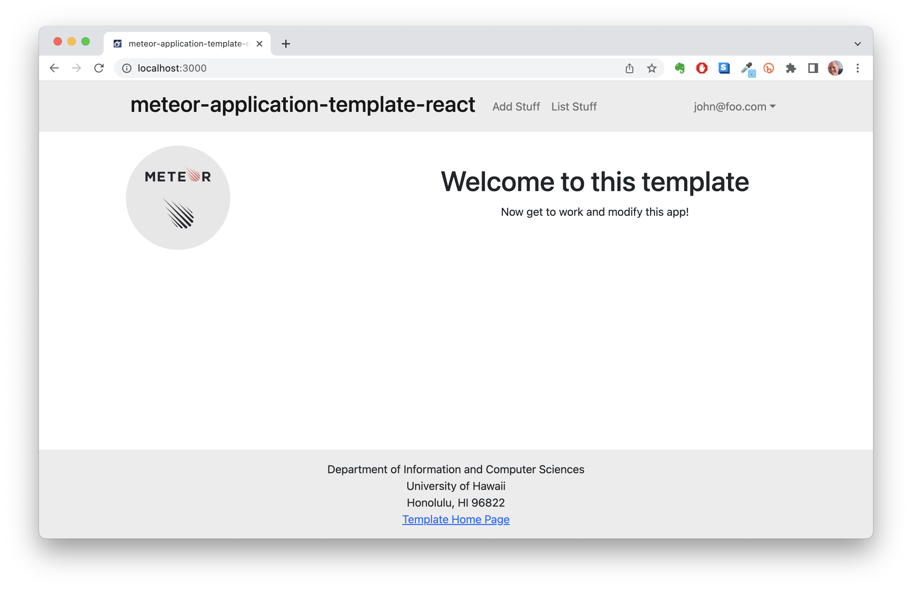

<div class="center"></div>

Digits is an application that allows users to:

  * Register an account
  * Create and manage a set of contacts
  * Add a set of timestamped notes to each contact

## Installation

First, [install Meteor](https://www.meteor.com/install).

Second, [download a copy of Digits](https://github.com/mnakagawa14/digits). Note that Digits is a private repo and so you will need to request permission from the author to gain access to the repo.

Third, cd into the app/ directory of your local copy of the repo, and install third party libraries with:

```
$ meteor npm install
```

## Running the system

Once the libraries are installed, you can run the application by invoking the "start" script

```
$ meteor npm run start
```

The first time you run the app, it will create some default users and data. Here is the output:

```
 meteor npm run start

> meteor-application-template-react@ start C:\Users\micha\Documents\GitHub\digits\app
> meteor --no-release-check --exclude-archs web.browser.legacy,web.cordova --settings ../config/settings.development.json

[[[[[ C:\Users\micha\Documents\GitHub\digits\app ]]]]]

=> Started proxy.
=> Started HMR server.
=> Started MongoDB.                           
I20231106-22:47:49.395(-10)? Creating the default user(s)
I20231106-22:47:49.410(-10)?   Creating user admin@foo.com.
I20231106-22:47:50.191(-10)?   Creating user john@foo.com.
I20231106-22:47:50.408(-10)? Creating default contacts.
I20231106-22:47:50.409(-10)?   Adding: Johnson (john@foo.com)
I20231106-22:47:50.449(-10)?   Adding: Casanova (john@foo.com)
I20231106-22:47:50.452(-10)?   Adding: Binsted (admin@foo.com)
=> Started your app.

=> App running at: http://localhost:3000/
```

### Viewing the running app

If all goes well, the template application will appear at [http://localhost:3000](http://localhost:3000).  You can login using the credentials in [settings.development.json](https://github.com/ics-software-engineering/meteor-application-template-react/blob/main/config/settings.development.json), or else register a new account.

### ESLint

You can verify that the code obeys our coding standards by running ESLint over the code in the imports/ directory with:

```
meteor npm run lint
```

## Walkthrough

The following sections describe the major features of this template.

### Application functionality

#### Landing page

When you retrieve the app at http://localhost:3000, this is what should be displayed:

<div class="center"></div>

The next step is to use the Login menu to either Login to an existing account or register a new account.

#### Login page

Clicking on the Login link, then on the Sign In menu item displays this page:

<div class="center"></div>

#### Register page

Alternatively, clicking on the Login link, then on the Sign Up menu item displays this page:

<div class="center"></div>


#### Landing (after Login) page, non-Admin user

Once you log in (either to an existing account or by creating a new one), the navbar changes as follows:

<div class="center"></div>

You can now add new Stuff documents, and list the Stuff you have created. Note you cannot see any Stuff created by other users.

#### List Contacts

Clicking on the List Contacts link brings up a page that lists all the contacts associated with the logged-in user.

<div class="center"></div>

This page also allows the user to add timestamped "notes" detailing interactions they've had wi the contact.

<div class="center"></div>

#### Edit Contacts
From the List Contacts page, the user can click the "Edit" link associated with any Contact to bring up a page that allows the Contact information to be edited.

<div class="center"></div>

#### Admin Mode

It is possible to designate one or more users as “Admins” through the settings file. When a user has the Admin role, they get access to a special NavBar link that retrieves a page listing all Contacts associated with all users.

<div class="center"></div>